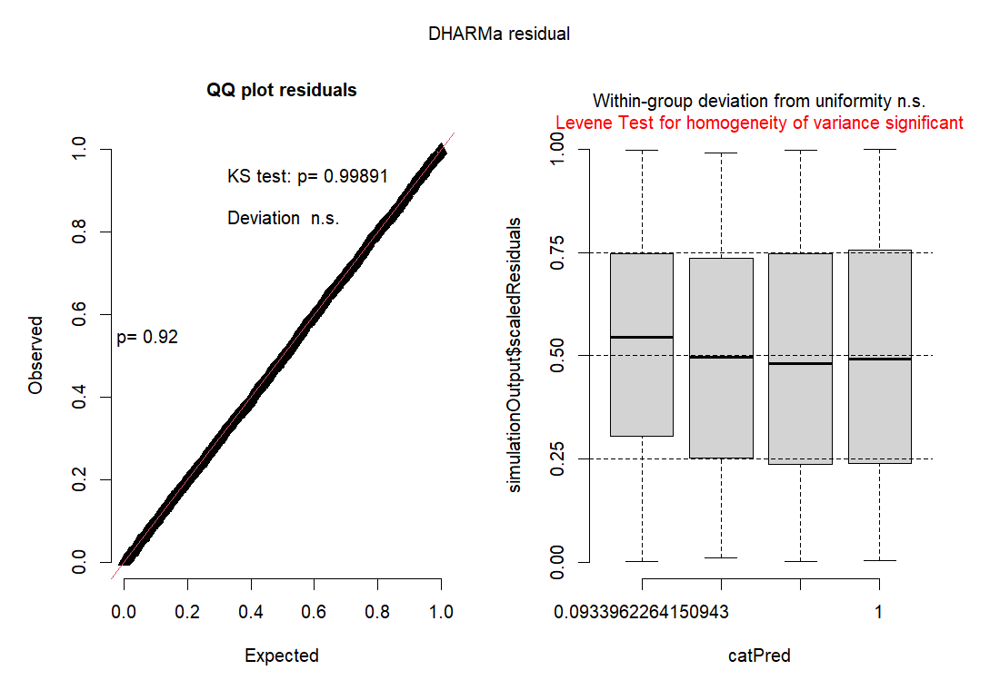

```{r setup, include=FALSE}
knitr::opts_chunk$set(echo = FALSE)
```

## Introducción

La ardilla gris es nativa de norte américa, pero fue introducida en Europa donde se comporta como especie invasora, desplazando a la ardilla roja. Por ello, es importante conocer sus hábitos alimenticios, para poder poner trampas en su horario y lugar de alimentación sin que afecte a otros organismos (Pepito et al., 2022).


## Metodología

## Effects


## DHARMa residual


